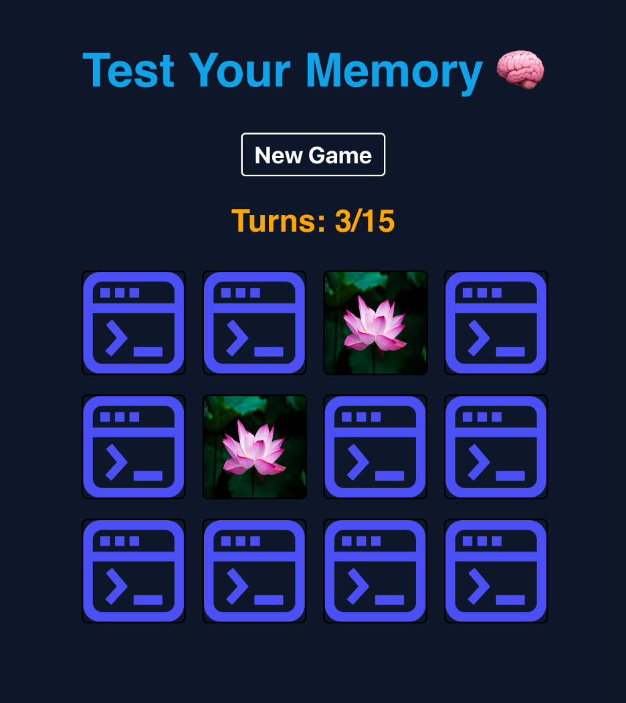

# React Memory Game Deployment with Ansible Automation

## Project Overview

In this project, I set up and deployed a React application using Ansible. The application is an online memory game that aims to improve one's memory.

With Ansible, I was able to eliminate repetitive manual steps like setting up server configurations, installing dependencies, and deploying code. This not only saves time but also ensures consistent and error-free deployments across different environments.

## Introduction

Ansible is an open-source IT automation tool that helps automate tasks such as configuration management, application deployment, and orchestration. It is widely used for managing complex IT environments and ensuring consistency across systems.

## Game Description

At the start, each card in a three-by-four grid shows the same icon. Players flip cards to find matching pairs. If cards don't match, they flip back, and the 'Turns' counter increments by 1. To win, find all pairs within 15 turns. The "New Game" button reshuffles the cards and resets the 'Turns' counter to 0.

<p align="center">
  
</p>
<div align="center">
  *Screenshot displaying the front-end interface of the application.*
</div>

## Prerequisites

- Ansible installed on your local machine.
- Node.js, npm, and React installed on your local machine.
- A web server (e.g., Nginx, Apache) to serve the React application.

## Installation

1. Clone the repository:
    ```bash
    git clone https://github.com/yourusername/React_Memory_Game_Deployment_Ansible_Automation.git
    cd React_Memory_Game_Deployment_Ansible_Automation
    ```

2. Navigate to the Ansible directory:
    ```bash
    cd ansible
    ```

3. Add the web server to the inventory:
    ```bash
    echo "webserver ansible_host=0.0.0.0" >> hosts
    ```

## Creating the Ansible Playbook

Create a file named `playbook.yml` in the `ansible` directory. This playbook will include multiple tasks to automate the deployment process.

## Playbook Tasks

1. Install Aptitude
2. Install curl and wget
3. Install Required System Packages
4. Install NodeJS
5. Build and Run the Application

## Usage

- Navigate to the `ansible` directory and run the Ansible playbook using the terminal:

  ```bash
  ansible-playbook playbook.yml -i hosts

## Access

After running the playbook, users can access the deployed game by visiting the server's IP address or domain name in a browser. 

For example, if the server's IP address is `0.0.0.0`, the game can be accessed by navigating to `http://0.0.0.0:3000` in a web browser.

## Ansible Inventory

The `hosts` file, also known as the Ansible inventory, specifies the target servers for deployment. Configure it with the IP address or hostname of the server where the game will be deployed. 
Here is an example of how to add a web server to the inventory:

```bash
echo "webserver ansible_host=0.0.0.0" >> hosts

```
## Playbook Example

```yaml
---
- hosts: all
  connection: local
  become: yes
  tasks:
    - name: Install aptitude
      apt:
        name: aptitude
        state: latest
        update_cache: yes
    - name: Install curl
      apt:
        name: curl
        state: present
    - name: Install wget
      apt:
        name: wget
        state: present
    - name: Install required system packages
      apt:
        pkg:
          - apt-transport-https
          - ca-certificates
          - software-properties-common
          - python3-pip
          - virtualenv
          - python3-setuptools
        state: latest
        update_cache: true
    - name: "Add nodejs 16.x ppa for apt repo"
      shell: curl -fsSL https://deb.nodesource.com/setup_16.x | bash -
    - name: "install node"
      shell: apt-get install -y nodejs
    - name: build app
      shell: cd /usercode/memory_game/ && npm install
    - name: run app
      shell: cd /usercode/memory_game/ && npm start
